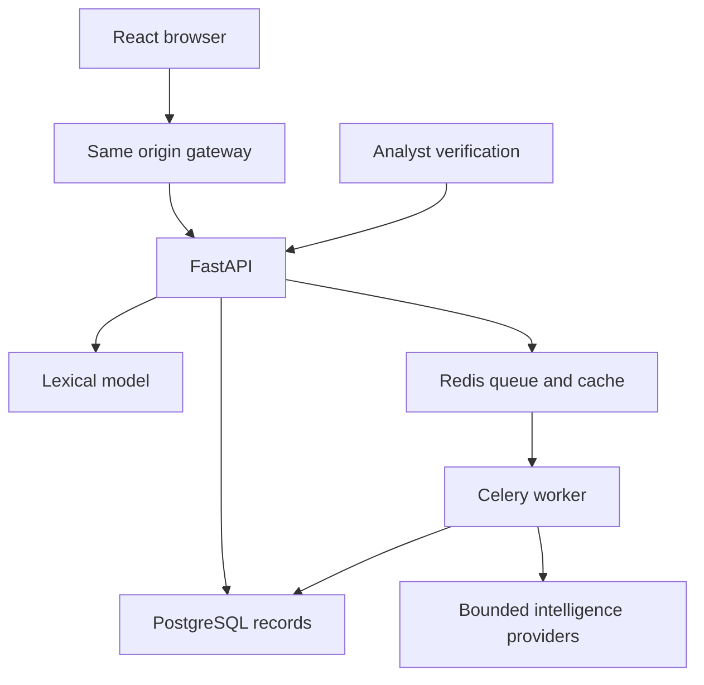
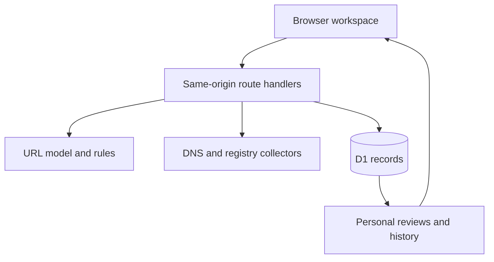

# ThreatLens architecture

The public edition runs TypeScript model inference and bounded DNS/RDAP collectors on the hosted Worker. Cloudflare D1 stores visitor-scoped investigations, reviews, feedback flags, recent review events and rate counters. A random 256-bit HTTP-only cookie identifies a browser workspace; its SHA-256 digest keys database ownership. Every record query checks ownership and expiry. Public reviews never change model scores or other visitors' reputation.

The public edition has no Celery dependency. Deep collectors run concurrently with bounded timeouts. The portable team edition places FastAPI behind Nginx, uses PostgreSQL and Redis/Celery, and keeps its role-key access design. Public visitors do not need that installation.

Retention: records become inaccessible 30 days after creation; new scans prune up to 100 expired rows per request. A browser has at most 200 reports; old reports and dependent notes are evicted together. Reviews keep the latest 20 activity events per report. Manual delete/clear operations cascade. Browser cookies have a fixed 30-day lifetime; there is no recovery or cross-device sync.
